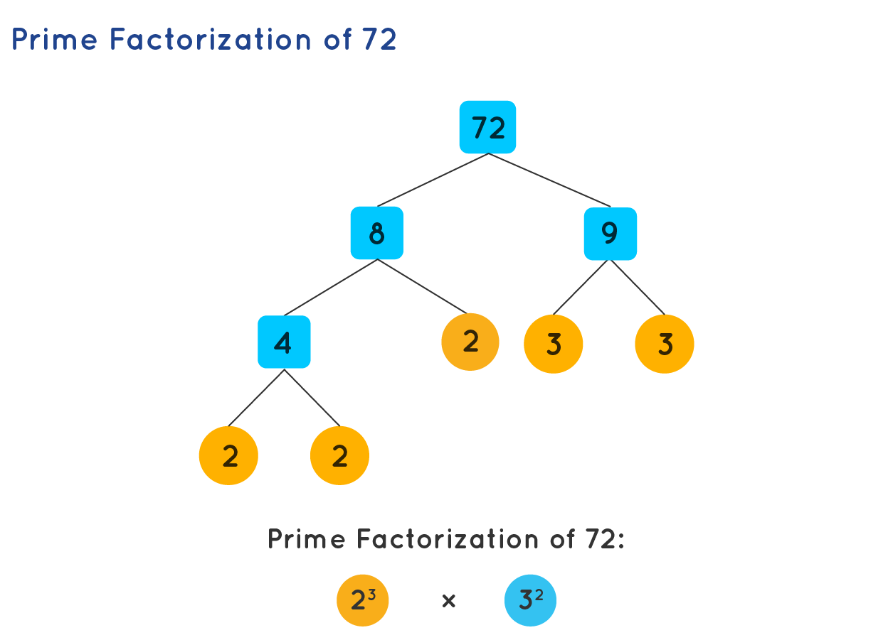

= Concurrent Web Server
:experimental:
:nofooter:
:source-highlighter: highlightjs
:sectnums:
:stem: latexmath
:toc:
:xrefstyle: short

[[problem_statement]]
== Problem description (Analysis)
The following project consists of a concurrent and distributed server that allows users to request the prime factorization or goldbach sums of any given number, through two separate applications. Both of these are integrated into the server, but are not yet implemented as independent processes or threads (a task for future versions). This project involves both task concurrency and data parallelism, as well as a basic approach to networks.

The following lines summarize the fundamentals of prime factorization and Goldbach’s conjecture for a better understanding of the program’s use.

=== Prime Factorization
Positive whole numbers, excluding the first one (1), can be divided into two main groups: prime numbers and composite numbers. The former group consists of numbers only divisible by 1 and itself (e.g. 2, 3, 5), while the latter encapsulates numbers with more than two divisors (e.g. 4, which is divisible by 2) and can be broken down into prime factors. For instance, the prime factorization of 72 is 2 * 2 * 2 * 3 * 3, which can also be expressed as 2^3 * 3^2, where ^ precedes an exponent. The following figure shows the process of calculating the factors.

[[prime_fact_example]]
.Breakdown process example for 72

Source: https://www.cuemath.com/numbers/prime-factorization/

Visit the following link https://jeisson.ecci.ucr.ac.cr/concurrente/2021b/tareas/#problem_statement_serial for the source of the adapted explanation.

=== Goldbach’s Conjecture
This conjecture establishes that every integer greater than 5 can be expressed as the sum of prime numbers. It is commonly divided into two separate conjectures:

- *Strong Goldbach conjecture*: every even number greater than 5 can be written as the sum of two primes. For example, 6 can be split into 3 + 3, 18 into 7 + 11 or 5 + 13, 28 into 11 + 17 or 13 + 15, etc.

- *Weak Goldbach conjecture*: all odd integers greater than 5 are the sum of three primes. For instance, 7 is the sum of 2 + 2 + 3, 9 into 3 + 3 + 3 or 2 + 2 + 5, and others.

The strong conjecture remains unproven, whereas the weak form is widely regarded as true by most mathematicians, at least for sufficiently large integers. The following figure visualizes the strong conjecture, where colored lines for prime numbers intersect (unfilled circles) to form distinct even numbers.

[[goldbach_example]]
.Breakdown process example for 72

Source: https://en.wikipedia.org/wiki/Goldbach%27s_conjecture

Visit https://jeisson.ecci.ucr.ac.cr/concurrente/2022b/tareas/#problem_statement_serial for the source explanation for this part of the project.

== User’s manual
=== Prerequisites
1. Clone the GitLab repository.
2. C++ compiler with c++ 17 (g++, clang)

=== Compilation
1. Run the _make run_ command in the terminal from the *web_server_11* folder to compile the program.

2. Then, use an execution command similar to the following line in the terminal `$./bin/web_server_11 8080 30 70`, where:

- 8080 can be replaced the port through which the connection with the server will be established, which has to be greater than 1023
- 30 represents the number of concurrent connections allowed.
- 70 represents the capacity of the pending connection queue.

3. Verify that the server is running by entering the following URL on your web browser: http://localhost:8080

4. Make your queries to the server about prime factorization and Goldbach sums

=== Input and Output
You can request for a list of numbers to be processed, separated by commas, either in the input box or specified in the URL following the format: _"http://localhost"_ followed by: _[port][appName]=[num1],[num2],...,[num_n]_. Results for each requested number will be listed on screen.

==== Prime factorization app
In this application, users will be able to see the prime factorizations for the numbers requested listed in product-exponent form, similar to figure shown in the analysis.

==== Goldbach sums app
To request the specific sums for a number, enter it as a negative. Alternatively, if only the amount of sums is desired, the number can be written as is (positive). A list of sums or amounts will be shown on screen as a response.

=== Stopping the server
1. Press Ctrl + C in the terminal where the program is running.
2. Alternatively, use the kill command to stop the server from running.

=== Concurrency testing
To test concurrency, follow these steps:
1. Open two different windows or tabs.
2. In one, request a heavy or long-lasting calculation.
3. In the other device, request a quick calculation at the same time.
4. Verify that the expected fast calculation response arrives without waiting for the heavy one to finish first.

