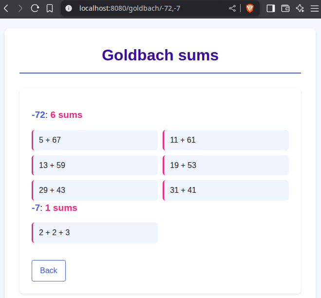
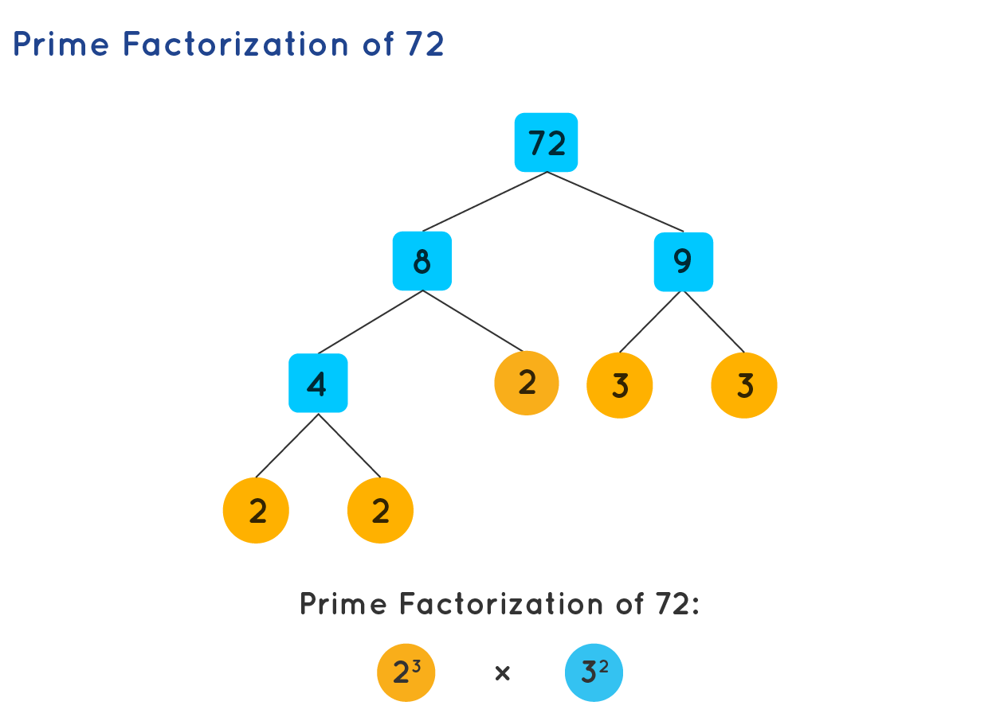
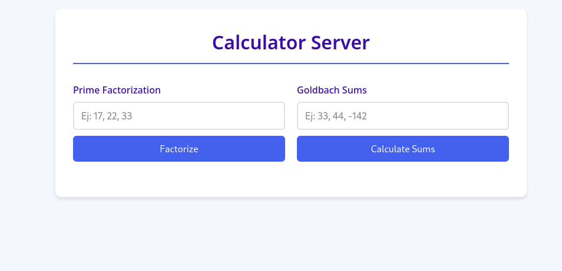
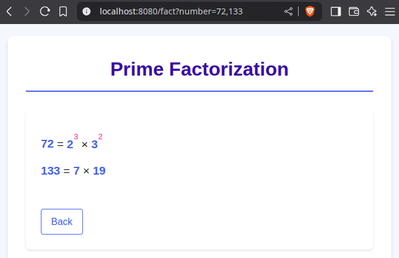

= Concurrent Web Server
:experimental:
:nofooter:
:source-highlighter: highlightjs
:sectnums:
:stem: latexmath
:toc:
:xrefstyle: short

== Preview
[.text-center]

This is an example of a Goldbach result for a query with three numbers: 72, 44, and -142. If the numbers are positive, the page displays only the number of Goldbach sums for that number; otherwise, a list of all results is displayed.

[[problem_statement]]
== Problem description (Analysis)
The purpose of this project is to create a distributed, concurrent web server that provides service for serial and concurrent web applications, such as Goldbach summation and prime factorization calculators. This project addresses task concurrency and data parallelism, as well as a basic approach to networking with http clients and cluster work distribution.

[[structure]]
== Structure of the project
The program receives a certain number of requests from server clients, each containing numbers to be evaluated and an identifier indicating the operation to be performed. These requests are placed in a waiting queue to be processed by a group of threads that have access to the server's applications or by other machines available at workers.

Within each web application, the requests are parsed to extract the individual values needed for the calculations. Once all the results have been obtained, they are returned to the client in the same format in which they were received by the server.

The following lines summarize the fundamentals of prime factorization and Goldbach’s conjecture for a better understanding of the program’s use.

=== Prime Factorization
Positive whole numbers, excluding the first one (1), can be divided into two main groups: prime numbers and composite numbers. The former group consists of numbers only divisible by 1 and itself (e.g. 2, 3, 5), while the latter encapsulates numbers with more than two divisors (e.g. 4, which is divisible by 2) and can be broken down into prime factors. For instance, the prime factorization of 72 is 2 * 2 * 2 * 3 * 3, which can also be expressed as 2^3 * 3^2, where ^ precedes an exponent. The following figure shows the process of calculating the factors.

[[prime_fact_example]]
.Breakdown process example for 72

Source: https://www.cuemath.com/numbers/prime-factorization/

Visit the following link https://jeisson.ecci.ucr.ac.cr/concurrente/2021b/tareas/#problem_statement_serial for the source of the adapted explanation.

=== Goldbach’s Conjecture
This conjecture establishes that every integer greater than 5 can be expressed as the sum of prime numbers. It is commonly divided into two separate conjectures:

- *Strong Goldbach conjecture*: every even number greater than 5 can be written as the sum of two primes. For example, 6 can be split into 3 + 3, 18 into 7 + 11 or 5 + 13, 28 into 11 + 17 or 13 + 15, etc.

- *Weak Goldbach conjecture*: all odd integers greater than 5 are the sum of three primes. For instance, 7 is the sum of 2 + 2 + 3, 9 into 3 + 3 + 3 or 2 + 2 + 5, and others.

The strong conjecture remains unproven, whereas the weak form is widely regarded as true by most mathematicians, at least for sufficiently large integers. The following figure visualizes the strong conjecture, where colored lines for prime numbers intersect (unfilled circles) to form distinct even numbers.

[[goldbach_example]]
.Breakdown process example for 72
image::images/goldbach_sums.png[]

Source: https://en.wikipedia.org/wiki/Goldbach%27s_conjecture

Visit https://jeisson.ecci.ucr.ac.cr/concurrente/2022b/tareas/#problem_statement_serial for the source explanation for this part of the project.

== User’s manual

=== Prerequisites

*Important:* A Unix/Linux variant is required as the operating system. Ej: debian, fedora.

Clone the GitLab repository.

[source]
----
$ git clone https://git.ucr.ac.cr/AXEL.ROJASRETANA/paralela25a-stockholm_syndrome.git
----

Install a C++ compiler with C++17 support (e.g., g++ or clang).

[source]
----
g++ (Ubuntu 13.3.0-6ubuntu2~24.04) 13.3.0
Copyright (C) 2023 Free Software Foundation, Inc.
This is free software; see the source for copying conditions.  There is NO
warranty; not even for MERCHANTABILITY or FITNESS FOR A PARTICULAR PURPOSE.
----

Install make program

[source]
----
$ sudo apt-get install make
----

=== Compilation

Compile the program by running the following command inside the *web_server* folder:

[source]
----
$ make clean && make
----

=== Running the server
The server can be run two different ways, as master or worker. The master server will handle the web requests and distribute the tasks to the workers, while the workers will process the tasks and return the results. There must be at least one master server running, and it can attend http requests by itselft until connection with workers is established. The workers will only process tasks assigned by the master server.

Execution mode is determined by the first command line argument passed to the server.

==== Master server
To run the master server, use the following command:
[source]
----
$ ./bin/web_server master max_worker_connections [port] [max_connections] [queue_capacity]
----

Where:

- `master` is the type of server to run.
- `max_worker_connections`  Max amount of worker connections to be handled.
- `port` is the network port to listen incoming HTTP requests, default 8080
- `max_connections` is the max amount of connections the server can attend concurrently, default [the amount CPUs available].
- `queue_capacity` is the max amount of connections that can be stored in queue,default SEM_VALUE_MAX

*Note*: If more than the specified worker connections are rquested, this could lead to unexpected behavior, ensure to set it correctly before running the master server.

==== Worker server
To run the worker server, use the following command:

[source]
----
$ ./bin/web_server worker master_ip master_port
----

Where:

- `worker` is the type of server to run.
- `master_ip` is the IP address of the master server.
- `master_port` is the port where the master server is listening for connections.

=== Client connection (browser)

Verify the server is running by opening your browser and visiting:
[source]
----
http://localhost:8080
----

Use the server to make queries about prime factorization and Goldbach sums.

=== Input and Output
You can request for a list of numbers to be processed, separated by commas, either in the input box or specified in the URL following the format: _"http://localhost"_ followed by: _[port][appName]=[num1],[num2],...,[num_n]_. Results for each requested number will be listed on screen.

==== Prime factorization app
In this application, users will be able to see the prime factorizations for the numbers requested listed in product-exponent form, similar to figure shown in the analysis.

[.text-center]

==== Goldbach sums app
To request the specific sums for a number, enter it as a negative. Alternatively, if only the amount of sums is desired, the number can be written as is (positive). A list of sums or amounts will be shown on screen as a response.

[.text-center]

=== Stopping the server
1. Press Ctrl + C in the terminal where the program is running.
2. Alternatively, use the kill command to stop the server from running.

=== Stress testing (httperf)
To test concurrency and distribution efficiency, follow these steps:

1. Open two different windows or tabs.
2. In one, request a heavy or long-lasting calculation.
3. In the other device, request a quick calculation at the same time.
4. Verify that the expected fast calculation response arrives without waiting for the heavy one to finish first.

*Diferences between handling multiple connections version and concurrent apps version:*

Handling multiple connections version(30 threads and 70 queue capacity):
[source] 
----
$ httperf --server 192.168.100.8 --port 8080 --num-conns 200 --rate 50 --num-call 3 --uri /goldbach?number=922222 --timeout 2

Total: connections 200 requests 472 replies 408 test-duration 6.419 s

Connection rate: 31.2 conn/s (32.1 ms/conn, <=113 concurrent connections)
Connection time [ms]: min 370.8 avg 1897.4 max 3815.7 median 1923.5 stddev 772.1
Connection time [ms]: connect 23.1
Connection length [replies/conn]: 3.000
----

Concurrent apps version(30 threads and 70 queue capacity):
[source] 
----
$ httperf --server 192.168.100.8 --port 8080 --num-conns 200 --rate 50 --num-call 3 --uri /goldbach?number=922222 --timeout 2

Total: connections 200 requests 478 replies 417 test-duration 6.288 s

Connection rate: 31.8 conn/s (31.4 ms/conn, <=110 concurrent connections)
Connection time [ms]: min 268.4 avg 1721.7 max 3022.0 median 1808.5 stddev 722.1
Connection time [ms]: connect 3.2
Connection length [replies/conn]: 3.000
----

These results indicate that the second version of the server has improved both in efficiency and responsiveness. *for the same number*

*Success rate:*
According to the number of requests that were replied

- Handling multiple connections version: 86% success
- Concurrent apps version: 87% success

[[design]]
== Design of solution

For more technical details, see the link:design/readme.adoc[design/readme.adoc] folder with an overall design of the solution, including program structure, threads parallelism, and processes work distribution.