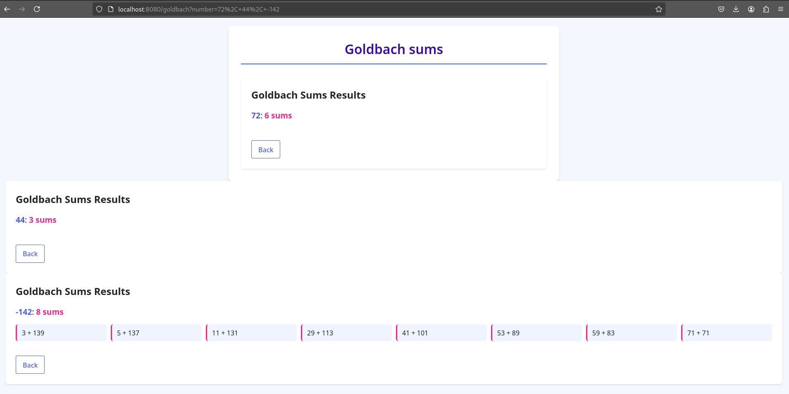
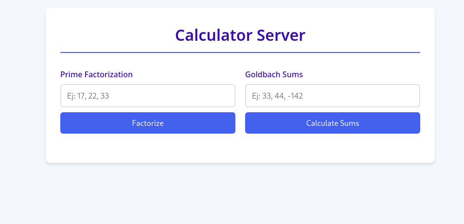
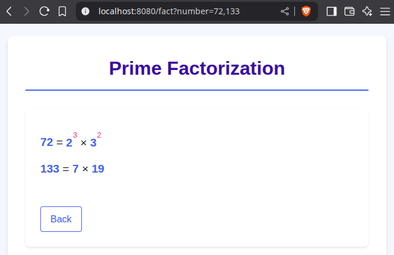

= Concurrent Web Server
:experimental:
:nofooter:
:source-highlighter: highlightjs
:sectnums:
:stem: latexmath
:toc:
:xrefstyle: short

== Preview

This is an example of a Goldbach result for a query with three numbers: 72, 44, and -142. If the numbers are positive, the page displays only the number of Goldbach sums for that number; otherwise, a list of all results is displayed.

[[problem_statement]]
== Problem description (Analysis)
The purpose of this project is to create a distributed, concurrent web server that provides concurrent service for different web applications, such as Goldbach summation and prime factorization calculators, running in parallel. This project addresses task concurrency and data parallelism, as well as a basic approach to networking.

[[structure]]
== Structure of the project
The program receives a certain number of requests from server clients, each containing numbers to be evaluated and an identifier indicating the operation to be performed. These requests are placed in a waiting queue to be processed by a group of threads that have access to the server's applications.

Within each web application, the requests are parsed to extract the individual values needed for the calculations. Once all the results have been obtained, they are returned to the client in the same format in which they were received by the server.

The following lines summarize the fundamentals of prime factorization and Goldbach’s conjecture for a better understanding of the program’s use.

=== Prime Factorization
Positive whole numbers, excluding the first one (1), can be divided into two main groups: prime numbers and composite numbers. The former group consists of numbers only divisible by 1 and itself (e.g. 2, 3, 5), while the latter encapsulates numbers with more than two divisors (e.g. 4, which is divisible by 2) and can be broken down into prime factors. For instance, the prime factorization of 72 is 2 * 2 * 2 * 3 * 3, which can also be expressed as 2^3 * 3^2, where ^ precedes an exponent. The following figure shows the process of calculating the factors.

[[prime_fact_example]]
.Breakdown process example for 72
image::images/prime_fact72.png[]

Source: https://www.cuemath.com/numbers/prime-factorization/

Visit the following link https://jeisson.ecci.ucr.ac.cr/concurrente/2021b/tareas/#problem_statement_serial for the source of the adapted explanation.

=== Goldbach’s Conjecture
This conjecture establishes that every integer greater than 5 can be expressed as the sum of prime numbers. It is commonly divided into two separate conjectures:

- *Strong Goldbach conjecture*: every even number greater than 5 can be written as the sum of two primes. For example, 6 can be split into 3 + 3, 18 into 7 + 11 or 5 + 13, 28 into 11 + 17 or 13 + 15, etc.

- *Weak Goldbach conjecture*: all odd integers greater than 5 are the sum of three primes. For instance, 7 is the sum of 2 + 2 + 3, 9 into 3 + 3 + 3 or 2 + 2 + 5, and others.

The strong conjecture remains unproven, whereas the weak form is widely regarded as true by most mathematicians, at least for sufficiently large integers. The following figure visualizes the strong conjecture, where colored lines for prime numbers intersect (unfilled circles) to form distinct even numbers.

[[goldbach_example]]
.Breakdown process example for 72
image::images/goldbach_sums.png[]

Source: https://en.wikipedia.org/wiki/Goldbach%27s_conjecture

Visit https://jeisson.ecci.ucr.ac.cr/concurrente/2022b/tareas/#problem_statement_serial for the source explanation for this part of the project.

== User’s manual

=== Prerequisites

*Important:* A Unix/Linux variant is required as the operating system. Ej: debian, fedora.

Clone the GitLab repository.

[source]
----
$ git clone https://git.ucr.ac.cr/AXEL.ROJASRETANA/paralela25a-stockholm_syndrome.git
----

Install a C++ compiler with C++17 support (e.g., g++ or clang).

[source]
----
g++ (Ubuntu 13.3.0-6ubuntu2~24.04) 13.3.0
Copyright (C) 2023 Free Software Foundation, Inc.
This is free software; see the source for copying conditions.  There is NO
warranty; not even for MERCHANTABILITY or FITNESS FOR A PARTICULAR PURPOSE.
----

Install make program

[source]
----
$ sudo apt-get install make
----

=== Compilation

Compile the program by running the following command inside the *web_server_11* folder:

[source]
----
$ make run
----

Run the server using a command like the following:

[source]
----
$ ./bin/web_server_11 8080 30 70
----

Where:
- `8080` is the port for server connection (must be >1023),
- `30` is the max number of concurrent connections,
- `70` is the capacity of the pending connection queue.

Verify the server is running by opening your browser and visiting:

[source]
----
http://localhost:8080
----

Use the server to make queries about prime factorization and Goldbach sums.

=== Input and Output
You can request for a list of numbers to be processed, separated by commas, either in the input box or specified in the URL following the format: _"http://localhost"_ followed by: _[port][appName]=[num1],[num2],...,[num_n]_. Results for each requested number will be listed on screen.

==== Prime factorization app
In this application, users will be able to see the prime factorizations for the numbers requested listed in product-exponent form, similar to figure shown in the analysis.

==== Goldbach sums app
To request the specific sums for a number, enter it as a negative. Alternatively, if only the amount of sums is desired, the number can be written as is (positive). A list of sums or amounts will be shown on screen as a response.

=== Stopping the server
1. Press Ctrl + C in the terminal where the program is running.
2. Alternatively, use the kill command to stop the server from running.

=== Concurrency testing (httperf)
To test concurrency, follow these steps:
1. Open two different windows or tabs.
2. In one, request a heavy or long-lasting calculation.
3. In the other device, request a quick calculation at the same time.
4. Verify that the expected fast calculation response arrives without waiting for the heavy one to finish first.

*Diferences between serial and concurrent version:*

Serial (1 thread):
[source] 
----
$ httperf --server 10.137.1.117 --port 8080 --num-conns 200 --rate 50 --num-call 3 --uri /goldbach?number=922222 --timeout 1

Total: conections 200 request 369 replies 179 test-duration 12.319 s

Connection rate: 16.2 conn/s (61.6 ms/conn, <=139 concurrent connections)
Connection time [ms]: min 93.6 avg 3816.0 max 9598.2 median 3768.5 stddev 2993.8
Connection time [ms]: connect 3017.6
Connection length [replies/conn]: 1.000
----

Concurrent (30 threads and 70 queue capacity):
[source] 
----
$ httperf --server 10.137.1.117 --port 8080 --num-conns 200 --rate 50 --num-call 3 --uri /goldbach?number=922222 --timeout 3

Total: conections 200 request 465 replies 385 test-duration 11.118 s

Connection rate: 18.0 conn/s (55.6 ms/conn, <=170 concurrent connections)
Connection time [ms]: min 1928.0 avg 5590.0 max 8817.2 median 5853.5 stddev 2185.9
Connection time [ms]: connect 1311.0
Connection length [replies/conn]: 2.810
----

The results show that concurret version could manage more requests in less time *for the same number*

*Success rate:*
According to the number of requests that were replied

- Serial: 49% success
- Concurrent: 82% success

[[design]]
== Design of solution

See the link:design/readme.adoc[design/readme.adoc] folder for an overall design of the solution, including program structure.
